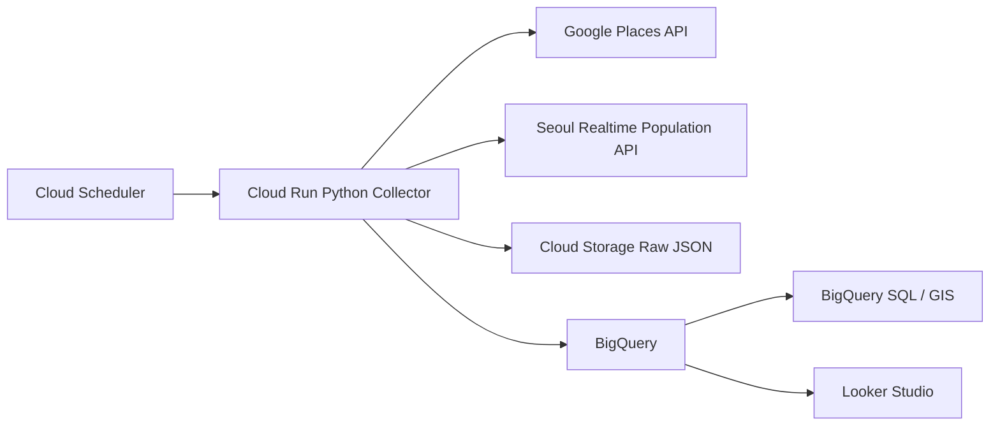
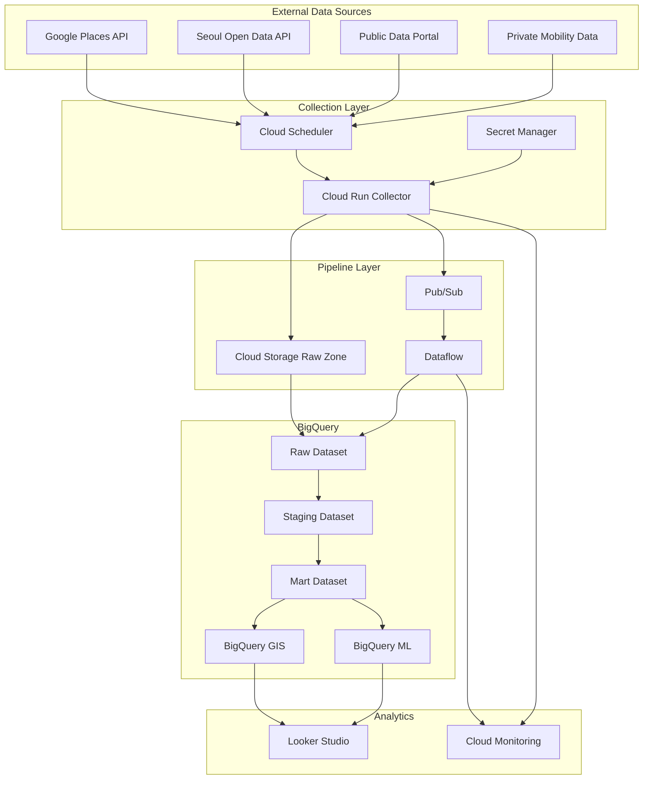

# GCP 유동인구 분석 시스템 아키텍처

## 1. 설계 개요

이 시스템은 Google Maps 화면의 `인기 시간대`를 크롤링하는 방식이 아니라, 다음 데이터를 조합하여 자체 유동인구/혼잡도 지수를 생성합니다.

- Google Places API: 장소 마스터 데이터
- 서울 실시간 도시데이터 API: 실시간 인구/혼잡도/교통/날씨/행사
- 서울 생활인구/공공데이터포털: 과거 시간대별 인구/관광/행사 정보
- 민간 데이터: 통신사/카드/센서 기반 유동인구
- BigQuery GIS: 장소 반경, 행정동, 격자 기반 공간 분석

## 2. 데이터 역할 분리

| 구분 | 역할 | 저장 위치 |
|---|---|---|
| Google Places API | 장소명, Place ID, 좌표, 업종, 평점, 영업시간 | `dim_place` |
| 서울 실시간 인구 API | 실시간 인구/혼잡도 | `fact_population_hourly` |
| 공공데이터포털 | 과거 생활인구, 관광지, 행사, 날씨 | `fact_population_hourly`, `dim_event` |
| 민간 유동인구 | 고정밀 시간대별 인구 | `fact_population_hourly` |
| BigQuery GIS | 반경 500m 공간 조인 | View 또는 Mart |

## 3. PoC 구성

### PoC 장점

- 빠르게 구축 가능
- 비용이 낮음
- GCP 운영 구조를 단순하게 확인 가능
- Google Places API 호출량을 최소화 가능

## 4. 운영 구성

## 5. GCP 서비스별 역할

| GCP 서비스 | 역할 |
|---|---|
| Cloud Scheduler | 수집 주기 제어. 5분/10분/일 단위 |
| Cloud Run | Python 수집 프로그램 실행 |
| Secret Manager | Google/Seoul/Public API Key 보관 |
| Cloud Storage | 원본 JSON/CSV 저장. 재처리와 감사 목적 |
| Pub/Sub | 운영 확장 시 수집 이벤트 큐 |
| Dataflow | 데이터 정제, 검증, 스키마 변환 |
| BigQuery | Raw/Staging/Mart 분석 저장소 |
| BigQuery GIS | 좌표 기반 반경 분석, 공간 조인 |
| BigQuery ML | 혼잡도 예측, 이상치 탐지 |
| Looker Studio | 지도, 시간대별 그래프, 비교 대시보드 |
| Cloud Monitoring | 오류, 지연, 비용, API 실패 알림 |

## 6. 수집 주기 권장안

| 데이터 | 수집 주기 | 비고 |
|---|---:|---|
| 서울 실시간 인구 | 5~10분 | 과거 미제공 가능성이 있으므로 직접 저장 |
| 서울 실시간 도시데이터 전체 | 10분 | 인구+교통+날씨+행사 |
| Google Places 기본정보 | 최초 1회, 이후 주 1회 | 비용 절감 위해 캐시 |
| 공공 관광/행사 데이터 | 1일 1회 | 행사 영향 분석 |
| 날씨 데이터 | 1시간 | 혼잡도 보정 |
| 민간 유동인구 데이터 | 계약 기준 | 통신사/카드사 제공 주기 따름 |

## 7. 분석 흐름

1. Place ID와 좌표를 `dim_place`에 저장
2. 실시간 인구 API를 주기적으로 호출하여 Raw JSON 저장
3. JSON을 정제하여 시간대별 인구 테이블 생성
4. BigQuery GIS로 장소 반경 500m 유동인구 계산
5. 장소별 최대/평균 대비 0~100 혼잡도 지수 산정
6. Looker Studio에서 지도/시간대/요일별 대시보드 구성

## 8. 보안 원칙

- API Key는 코드에 저장하지 않고 Secret Manager 사용
- Cloud Run 서비스 계정에 최소 권한 부여
- BigQuery Dataset 권한은 분석 사용자/운영자로 분리
- Google Maps API Key는 Places API로 제한
- Cloud Scheduler 호출은 OIDC 인증 적용 권장

## 9. 비용 최적화 원칙

- Google Places API는 장소 마스터 수집에만 사용
- `photos`, `reviews` 같은 고비용 필드는 제외
- BigQuery 테이블은 날짜 파티션 적용
- Mart 테이블을 미리 만들어 Looker Studio 쿼리 비용 절감
- Cloud Run은 요청 기반으로만 실행
